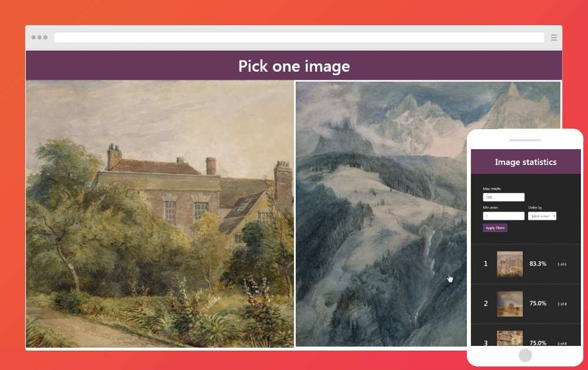

## Pick-One

This is a side project that I made in a couple of days. The functionality is very simple. In the main page (index.php) two random images are shown side by side and the user is asked to pick one.

Then, based on the results of thousands of submissions, the  statistics page (statistics.php) shows you which are the most and less picked images by average. You can filter and order these results based on a treshhold of votes.

For the statistics to be accurate all images must have a big enough amount of votes (in the hundreds at least).

### Technologies
- HTML, CSS, Javascript
- PHP, MySQL

### Features:
- PHP ini file for storing credentials securely
- Responsive design
- Query filters

### Usage

The config.ini must be outside the public/webroot folder for security reasons. This file contains the mysql connection configuration and other app settings, like the folder where the images are stored.

The folder for the images must be publicly accesible and here is where you have to place all the images for the collection.

For this web to work you first need to create the database and table needed for storing the results in MySQL. The sql instructions for creating the database and table are on the my_sql_db.sql file.